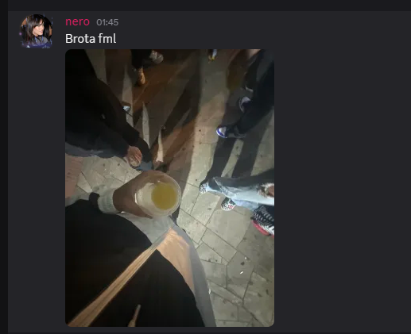

<h1 align="center">Hello!👋 Welcome to my profile</h1>

###

  
  
  

###

  

###

  

###

<picture>
  <source media="(prefers-color-scheme: dark)" srcset="https://raw.githubusercontent.com/fully1337/fully1337/output/pacman-contribution-graph-dark.svg">
  <source media="(prefers-color-scheme: light)" srcset="https://raw.githubusercontent.com/fully1337/fully1337/output/pacman-contribution-graph.svg">
  
</picture>

###
